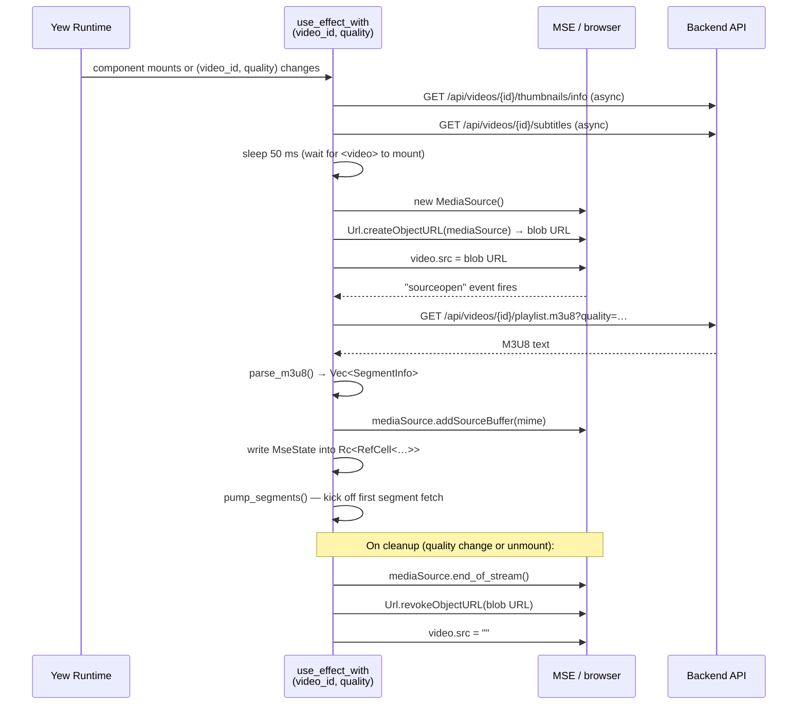
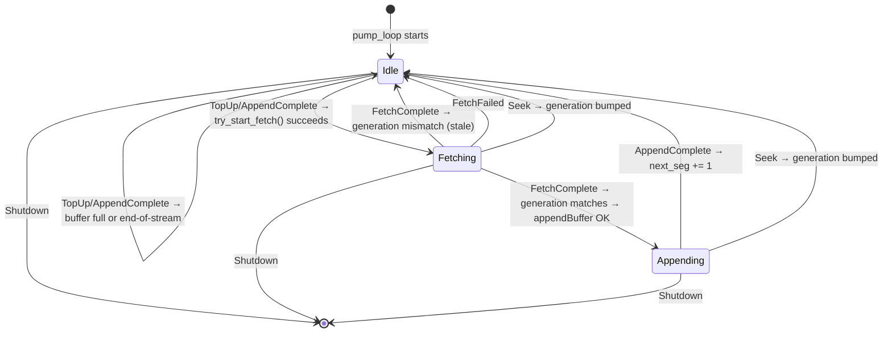
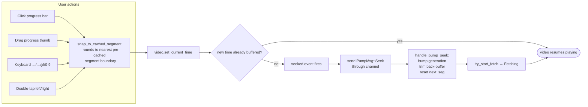
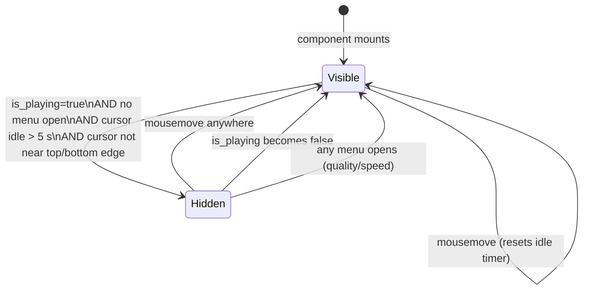

# Video Player Component — Architecture & State Reference

> **File:** `frontend/src/components/video_player.rs`
>
> This document describes the current state of the `VideoPlayer` Yew component so that it
> can be understood and refactored with confidence.

---

## Table of Contents

1. [High-Level Overview](#1-high-level-overview)
2. [Component State Variables](#2-component-state-variables)
3. [MSE Pipeline](#3-mse-pipeline)
4. [Initialization & Lifecycle](#4-initialization--lifecycle)
5. [Segment Pump Loop](#5-segment-pump-loop)
6. [Seek Flow](#6-seek-flow)
7. [Controls Auto-Hide State Machine](#7-controls-auto-hide-state-machine)
8. [Periodic Polling Interval (150 ms)](#8-periodic-polling-interval-150-ms)
9. [User Input & Callbacks](#9-user-input--callbacks)
10. [Constants Reference](#10-constants-reference)
11. [Known Complexity & Refactor Notes](#11-known-complexity--refactor-notes)

---

## 1. High-Level Overview

```
Browser
┌─────────────────────────────────────────────────────────────────────────────────┐
│  VideoPlayer (shell) ──▶ ControlBar ──▶ ProgressBar                            │
│                                                                                 │
│   ┌─────────────┐   sourceopen   ┌───────────────┐   appendBuffer  ┌─────────┐ │
│   │ MediaSource │──────────────▶│  SourceBuffer  │◀────────────── │ fetch() │ │
│   │  (blob URL) │               │  video/mp4     │                 │ seg_N   │ │
│   └──────┬──────┘               └───────┬────────┘                 └─────────┘ │
│          │ src=blob:…                   │ updateend                             │
│          ▼                              ▼                                       │
│   ┌─────────────┐              ┌────────────────┐                              │
│   │ <video> el  │              │  PumpMsg chan   │◀── TopUp (150ms interval)    │
│   │ (HtmlVideo  │              │  pump_loop()   │◀── Seek (seeked handler)     │
│   │  Element)   │              │  state machine │◀── AppendComplete (updateend)│
│   └─────────────┘              └────────────────┘                              │
│                                                                                 │
│   Yew state (use_state / use_mut_ref) drives all UI re-renders                 │
└─────────────────────────────────────────────────────────────────────────────────┘
         │ GET /api/videos/{id}/playlist.m3u8?quality=…
         │ GET /api/videos/{id}/seg_XXXXX.mp4?quality=…
         ▼
    Backend (Axum + FFmpeg)
```

The player uses the **W3C Media Source Extensions (MSE)** API directly — there is no
HLS.js or other JavaScript library. The Rust/WASM code:

1. Parses the server-produced M3U8 playlist into a list of segment URLs.
2. Creates a `MediaSource` + `SourceBuffer` and sets `video.src` to the corresponding
   blob URL.
3. Feeds segments into the `SourceBuffer` via a channel-driven async state machine
   (`pump_loop`) that processes `TopUp`, `Seek`, `AppendComplete`, `FetchComplete`,
   and `Shutdown` messages.

**Safari** receives the M3U8 URL directly (native HLS); the MSE path is skipped.

---

## 2. Component State Variables

### 2.1 Reactive State (`use_state`)

| Variable | Type | Initial | Purpose |
|---|---|---|---|
| `status` | `String` | `"Preparing stream…"` | Human-readable loading message shown in the UI overlay |
| `error` | `Option<String>` | `None` | Playback error text; renders the error notice panel |
| `current_time` | `f64` | `0.0` | Playback position in seconds, updated every 150 ms |
| `duration` | `f64` | `0.0` | Total video duration in seconds |
| `buffered_end` | `f64` | `0.0` | End of the buffered range covering `current_time` |
| `is_playing` | `bool` | `false` | Mirrors `!video.paused()` from the polling interval |
| `is_buffering` | `bool` | `false` | `true` when `readyState < HAVE_FUTURE_DATA (3)` and not paused |
| `volume` | `f64` | `1.0` | Current volume level (0.0 – 1.0) |
| `is_muted` | `bool` | `false` | Whether audio is muted |
| `prev_volume` | `f64` | `1.0` | Volume level saved before mute, restored on unmute |
| `is_dragging` | `bool` | `false` | `true` while the user holds the progress-bar thumb |
| `drag_time` | `f64` | `0.0` | Seek time being previewed during a drag |
| `just_dragged` | `bool` | `false` | Guards against the `onclick` firing after a `mouseup` drag release |
| `is_hovering_progress` | `bool` | `false` | `true` while the mouse is over the progress bar |
| `hover_time` | `f64` | `0.0` | Time position under the mouse cursor on the progress bar |
| `hover_position` | `f64` | `0.0` | Mouse X position as a percentage of the progress bar width |
| `controls_visible` | `bool` | `true` | Whether the controls bar and header are shown |
| `speed_menu_open` | `bool` | `false` | Speed selection popup visibility |
| `quality_menu_open` | `bool` | `false` | Quality selection popup visibility |
| `volume_slider_visible` | `bool` | `false` | Volume slider reveal on hover |
| `is_fullscreen` | `bool` | `false` | Fullscreen state updated by click/keyboard handlers **and** a `fullscreenchange` event listener on `document` |
| `playback_speed` | `f64` | `1.0` | Current playback rate |
| `selected_quality` | `String` | from localStorage or `"original"` | Active quality tier; changing it triggers re-initialisation |
| `thumbnail_info` | `Option<ThumbnailInfo>` | `None` | Sprite sheet metadata fetched from `/api/videos/{id}/thumbnails/info` |
| `last_tap_time` | `Option<f64>` | `None` | `Date.now()` of the last click wrapped in `Some`, or `None` when cancelled; used for double-tap detection |
| `last_tap_x` | `f64` | `0.0` | X position of the last click |
| `skip_indicator` | `Option<(String, f64)>` | `None` | `("forward"\|"backward", x_percent)` for the transient skip animation |
| `video_ended` | `bool` | `false` | `true` when `video.ended()` — shows the replay overlay |
| `thumbnail_image` | `Option<HtmlImageElement>` | `None` | Loaded sprite sheet `` used for canvas drawing |
| `subtitle_tracks` | `Vec<SubtitleTrack>` | `[]` | Available subtitle tracks fetched from the server |
| `active_subtitle` | `Option<u32>` | `None` | Index of the active subtitle track (`None` = off) |
| `captions_menu_open` | `bool` | `false` | Captions selection popup visibility |

### 2.2 Mutable Refs (`use_mut_ref` / `Rc<RefCell<…>>`)

These are **not** re-render-triggering; they hold values shared across async closures
or mutated too frequently to warrant a full re-render.

| Variable | Type | Purpose |
|---|---|---|
| `mse_state` | `Rc<RefCell<Option<MseState>>>` | The entire MSE player state (see §3). Shared by async tasks and the 150 ms interval. Written asynchronously inside `sourceopen`, so cannot be `use_state`. |
| `last_mouse_move` | `Rc<RefCell<f64>>` | `Date.now()` of the last mouse movement, used by the auto-hide interval to compare elapsed time without triggering re-renders. |
| `is_near_controls` | `Rc<RefCell<bool>>` | `true` while the cursor is within `CONTROLS_VICINITY_PX` of the top/bottom edge; suppresses auto-hide while a menu may be hovered. |
| `resume_position` | `Rc<RefCell<f64>>` | Playback time captured just before a quality change; read by the next `use_effect_with` run so the new stream starts at the same position. |

### 2.3 Node Refs

| Variable | Element | Used for |
|---|---|---|
| `video_ref` | `<video>` | Calling the native HTMLVideoElement API (play, pause, seek, duration …) |
| `progress_ref` | progress bar `<div>` | Computing click/drag X-offset relative to the bar's bounding rect |
| `container_ref` | outer wrapper `<div>` | Requesting fullscreen; computing mouse vicinity distance |
| `thumbnail_canvas_ref` | `<canvas>` | Drawing the sprite-sheet thumbnail preview |

---

## 3. MSE Pipeline

### 3.1 `MseState` struct

```
MseState {
    media_source: MediaSource,       // Owned MSE MediaSource object
    source_buffer: SourceBuffer,     // Single SourceBuffer (video/mp4; codecs="avc1.42E01E,mp4a.40.2")
    object_url: String,              // blob: URL → set as video.src; revoked on cleanup
    segments: Vec<SegmentInfo>,      // Parsed segment list (URL + duration) from M3U8
    next_seg: usize,                 // Index of the next segment to fetch
    generation: u32,                 // Monotonic seek counter — stale appends are discarded
    pump_tx: UnboundedSender<PumpMsg>, // Channel sender for the pump loop
    _updateend_closure: Closure,     // Persistent updateend listener (properly dropped on cleanup)
}
```

### 3.2 Pump channel messages

```
enum PumpMsg {
    AppendComplete,              // SourceBuffer updateend fired
    TopUp,                       // Top up buffer (150ms interval / initial kick)
    Seek(f64),                   // Seek to unbuffered position
    FetchComplete(u32, Vec<u8>), // Fetch succeeded (generation, bytes)
    FetchFailed(u32),            // Fetch failed after retries (generation)
    Shutdown,                    // Terminate the pump loop
}
```

### 3.3 Pump state machine

```
enum PumpState { Idle, Fetching, Appending }

Idle ──TopUp/AppendComplete──▶ try_start_fetch() → Fetching (if buffer needs data)
Fetching ──FetchComplete──▶ check generation → try_append_bytes() → Appending
Fetching ──FetchFailed──▶ Idle
Fetching ──Seek──▶ Idle (generation bumped; stale FetchComplete ignored)
Appending ──AppendComplete──▶ advance next_seg → Idle → try_start_fetch() → …
Appending ──Seek──▶ Idle (generation bumped)
Any ──Shutdown──▶ Exit
```

### 3.4 Segment format

All segments are **fragmented MP4** (fMP4) — not MPEG-TS. The server emits
`movflags=frag_keyframe+empty_moov+default_base_moof`. The MIME type used for
`addSourceBuffer` is:

```
video/mp4; codecs="avc1.42E01E,mp4a.40.2"
```

(H.264 Baseline + AAC-LC — covers all three server transcode paths.)

### 3.5 SourceBuffer mode & timestampOffset

The SourceBuffer is set to **`"sequence"` mode** immediately after creation.
This is critical for cross-browser compatibility (especially Firefox):

- The backend rebases video/audio PTS to ~0 in each fMP4 segment (remux/hybrid
  paths). Without sequence mode, Firefox strictly follows the MSE spec and
  places every segment at time 0, causing playback to stutter/reset.
- In sequence mode, MSE automatically places each appended segment after the
  end of the previous one.
- On seek, `abort()` is called to reset the parser state, then `timestampOffset`
  is set to the snapped seek time so the next append is placed correctly.
- On initial resume from a non-zero position, `timestampOffset` is set to
  `start_seg * SEGMENT_DURATION_F`.

---

## 4. Initialization & Lifecycle



**Key async sequencing constraints:**

- The `sourceopen` callback *must* be registered before the blob URL is set on `video.src`
  because the event fires synchronously on some browsers.
- `addSourceBuffer` may only be called from inside `sourceopen`.
- `mse_state` uses `use_mut_ref` (not `use_state`) so that the async write in
  `sourceopen` is visible to the cleanup closure that was captured earlier.

---

## 5. Segment Pump Loop

The pump is a **channel-driven async state machine** (`pump_loop`) that runs as a
single `spawn_local` task.  All external triggers communicate through an
`mpsc::unbounded()` channel:

| Trigger | Sends | When |
|---|---|---|
| 150 ms polling interval | `TopUp` | Every 150 ms |
| `seeked` event listener | `Seek(time)` | When a seek lands in unbuffered territory |
| Persistent `updateend` listener | `AppendComplete` | After every `appendBuffer` or `remove()` completes |
| Cleanup (unmount / quality change) | `Shutdown` | Before dropping `MseState` |
| Fetch task (spawned by pump) | `FetchComplete(gen, bytes)` / `FetchFailed(gen)` | When a segment fetch finishes |



**Key improvements over the previous `pump_segments` function:**

1. **No memory leaks** — the persistent `updateend` closure is stored in `MseState`
   and properly removed on cleanup, instead of one-shot closures being `.forget()`-ed.
2. **Non-blocking seek handling** — fetch tasks run independently; the pump loop can
   process `Seek` messages immediately even while a fetch is in-flight.
3. **Retry with back-off** — failed fetches are retried up to 3 times with exponential
   back-off (500 ms → 1 s → 2 s) before reporting `FetchFailed`.
4. **Generation-based staleness** — every `Seek` increments `generation`; stale
   `FetchComplete` messages are silently discarded.

**Back-buffer trimming** is performed inside `handle_pump_seek()`: when a seek
occurs, `source_buffer.remove(0, current_time - MSE_BACK_BUFFER_S)` is called
(if the source buffer is not already updating).

---

## 6. Seek Flow



`snap_to_cached_segment` maps the seek target to the server's pre-cache grid.
The dense window size is `PRECACHE_SEGMENTS_F × SEGMENT_DURATION_F = 20 × 6 = 120 s`.
Sparse anchors repeat every `SPARSE_CACHE_STRIDE_F × SEGMENT_DURATION_F = 3 × 6 = 18 s`.

- **Dense window** (0 – 120 s): every segment is cached → snaps to the nearest 6 s
  segment boundary.
- **Beyond 120 s**: only every 3rd segment is cached → snaps down to the nearest
  sparse anchor (every 18 s).

---

## 7. Controls Auto-Hide State Machine



Implementation details:
- A 1 s `Interval` checks `Date.now() - last_mouse_move > 5000 ms`.
- `last_mouse_move` is a `Rc<RefCell<f64>>` (not `use_state`) to avoid re-renders on
  every mouse movement.
- `is_near_controls` is also a ref: `true` when the cursor is within 80 px of the
  container's top or bottom edge, preventing hide while hovering menus.

---

## 8. Periodic Polling Interval (150 ms)

A single `gloo_timers::callback::Interval` fires every 150 ms (registered once via
`use_effect_with(video_ref.clone(), …)`) and performs all of the following:

| Task | How |
|---|---|
| Update `current_time` | `video.current_time()` (skipped while dragging) |
| Update `duration` | `video.duration()` if finite and > 0 |
| Update `buffered_end` | `get_buffer_end(&video)` |
| Update `is_playing` | `!video.paused()` |
| Update `is_buffering` | `video.ready_state() < 3 && !video.paused()` |
| Update `video_ended` | `video.ended()` |
| Top up MSE buffer | Send `PumpMsg::TopUp` through the channel |

---

## 9. User Input & Callbacks

### 9.1 Video element events

| Event | Handler | Action |
|---|---|---|
| `onclick` | `on_video_click` | Single click → play/pause after 300 ms (debounced for double-tap detection via `Option<f64>`). Double-click in left/right third → seek ±10 s. |
| `ondblclick` | `on_video_dblclick` | Toggle fullscreen. |
| `seeked` | (raw event listener) | Detect out-of-buffer seeks; send `PumpMsg::Seek(time)` through the channel. |

### 9.2 Progress bar events

| Event | Action |
|---|---|
| `onmousedown` | Start drag: set `is_dragging`, add global `mousemove` + `mouseup` listeners |
| `onmousemove` | Update `hover_time` / `hover_position` for thumbnail preview |
| `onmouseleave` | Clear `is_hovering_progress` |
| `onclick` | Seek to clicked position (guarded by `just_dragged` flag) |
| Global `mousemove` (while dragging) | Update `drag_time` / `current_time` display |
| Global `mouseup` (while dragging) | Commit seek via `video.set_current_time`; remove global listeners |

### 9.3 Keyboard shortcuts (global `keydown` listener)

| Key(s) | Action |
|---|---|
| `Space` / `k` | Play / Pause |
| `←` | Seek back 5 s (+ `Shift` → 10 s) |
| `→` | Seek forward 5 s (+ `Shift` → 10 s) |
| `j` | Seek back 10 s |
| `l` | Seek forward 10 s |
| `↑` / `↓` | Volume +10% / −10% |
| `m` | Toggle mute |
| `f` | Toggle fullscreen |
| `0`–`9` | Seek to 0 %–90 % of duration |
| `,` / `<` | Decrease playback speed |
| `.` / `>` | Increase playback speed |
| `Home` | Jump to 0:00 |
| `End` | Jump to end |

### 9.4 Control bar callbacks

| Callback | Trigger | Effect |
|---|---|---|
| `on_play_pause` | Play/Pause button | Toggle play/pause; resets to 0:00 if ended |
| `on_volume_toggle` | Speaker button | Mute / unmute; saves/restores volume level |
| `on_volume_change` | Volume range slider | Set volume; unmutes if > 0 |
| `on_fullscreen_toggle` | Fullscreen button | Enter/exit fullscreen |
| `on_speed_toggle` | Speed text button | Open/close speed menu |
| `on_speed_select` | Speed menu item | Set `playback_speed` and `video.playbackRate` |
| `on_quality_toggle` | Quality text button | Open/close quality menu |
| `on_quality_select` | Quality menu item | Capture `resume_position`, persist to localStorage, change `selected_quality` → triggers re-init |
| `on_captions_toggle` | CC button | Open/close captions menu |
| `on_caption_select` | Caption menu item | Add/remove `<track>` element on `<video>` |
| `on_replay` | Replay overlay button | Seek to 0:00 and call `video.play()` |
| `on_mouse_move` | Container `onmousemove` | Show controls; update `last_mouse_move`; update vicinity flag |
| `on_mouse_leave` | Container `onmouseleave` | Clear vicinity flag |
| `on_container_click` | Container `onclick` | Close all open menus |

---

## 10. Constants Reference

| Constant | Value | Description |
|---|---|---|
| `SEGMENT_DURATION_F` | `6.0` | Segment duration in seconds — **must match** `SEGMENT_DURATION` in `src/media/transcode.rs` |
| `PRECACHE_SEGMENTS_F` | `20.0` | Number of segments in the dense pre-cache window |
| `SPARSE_CACHE_STRIDE_F` | `3.0` | Stride for sparse anchor segments beyond the dense window |
| `CONTROL_HIDE_TIMEOUT_MS` | `5000.0` | Milliseconds of inactivity before controls auto-hide |
| `CONTROLS_VICINITY_PX` | `80.0` | Pixel distance from top/bottom edge to keep controls visible |
| `MSE_TARGET_BUFFER_S` | `30.0` | Target seconds of forward buffer before pump pauses |
| `MSE_BACK_BUFFER_S` | `5.0` | Seconds of back-buffer retained behind playback on seek |
| `QUALITY_STORAGE_KEY` | `"starfin_quality"` | localStorage key for quality persistence |
| `PLAYBACK_SPEEDS` | `[0.25, 0.5, 0.75, 1.0, 1.25, 1.5, 1.75, 2.0, 3.0]` | Available playback speed options |

---

## 11. Known Complexity & Refactor Notes

### 11.1 ~~Single monolithic function component~~ ✅ Resolved
~~The entire player is one `#[function_component]` function (~1,600 lines).
All state, effects, and callbacks are defined inline with liberal `clone()` chains.~~

The player is now split into three components:
- **`ProgressBar`** — presentational component for the progress bar area
  (progress track, buffered/played bars, hover line, thumb, thumbnail preview).
- **`ControlBar`** — presentational component for the bottom controls
  (play/pause, volume, time, speed menu, quality menu, captions, fullscreen);
  embeds `ProgressBar`.
- **`VideoPlayer`** (shell) — owns all state, effects, and MSE logic; composes
  `ControlBar` and passes state/callbacks as props.

### 11.2 ~~`is_appending` guard vs. `updateend`~~ ✅ Resolved
~~`pump_segments` relies on the `updateend` closure to reset `is_appending` and
re-call itself. This creates a chain of one-shot closures. If `updateend` fires
twice (or not at all on error), the pump stalls.~~

Replaced with a **channel-driven async state machine** (`pump_loop`) using
`futures::channel::mpsc::unbounded()`.  A single persistent `updateend`
listener sends `PumpMsg::AppendComplete` through the channel.  The pump loop
processes messages with a clear `Idle → Fetching → Appending` state machine.
No closures are `.forget()`-ed; the persistent listener is stored in `MseState`
and properly removed on cleanup.  Fetch tasks run independently via
`spawn_local`, so seeks are processed immediately even during in-flight fetches.

### 11.3 ~~Fullscreen state is tracked manually~~ ✅ Resolved
~~`is_fullscreen` is set synchronously in the click/keyboard handlers but is **not**
updated if the user presses `Esc` to exit fullscreen natively.~~

A `fullscreenchange` event listener on `document` now updates `is_fullscreen`
whenever the browser enters or exits fullscreen, regardless of how it was
triggered.

### 11.4 ~~Subtitle insertion model~~ ✅ Resolved
~~Subtitles are added by appending a `<track>` child element to `<video>` dynamically.
Existing tracks are hidden (not removed), so repeated selection cycles accumulate
hidden `<track>` elements.~~

`on_caption_select` now removes all existing `<track>` child elements from the
`<video>` before appending a new one, preventing accumulation.

### 11.5 ~~Double-tap / single-tap ambiguity~~ ✅ Resolved
~~The `last_tap_time` state set to 0.0 acts as a "cancelled" sentinel.~~

`last_tap_time` is now `Option<f64>` (`None` = no pending tap), making the
intent of the double-tap detection unambiguous.

### 11.6 ~~No seek-to-unbuffered back-pressure~~ ✅ Resolved
~~When the user seeks rapidly across unbuffered positions, multiple `seeked` events
fire in quick succession … causing a wrong-segment append.~~

`MseState` now carries a `generation: u32` counter.  The `seeked` handler
increments it on every out-of-buffer seek.  `pump_segments` captures the
generation at fetch-start and discards the response when it no longer matches,
preventing wrong-segment appends during rapid seeks.

### 11.7 ~~No error recovery / retry~~ ✅ Resolved
~~Segment fetch errors silently reset `is_appending = false` and stop the pump.~~

Segment fetches now retry up to 3 times with exponential back-off (500 ms →
1 s → 2 s) before giving up.  This covers transient network errors without
stalling playback.
